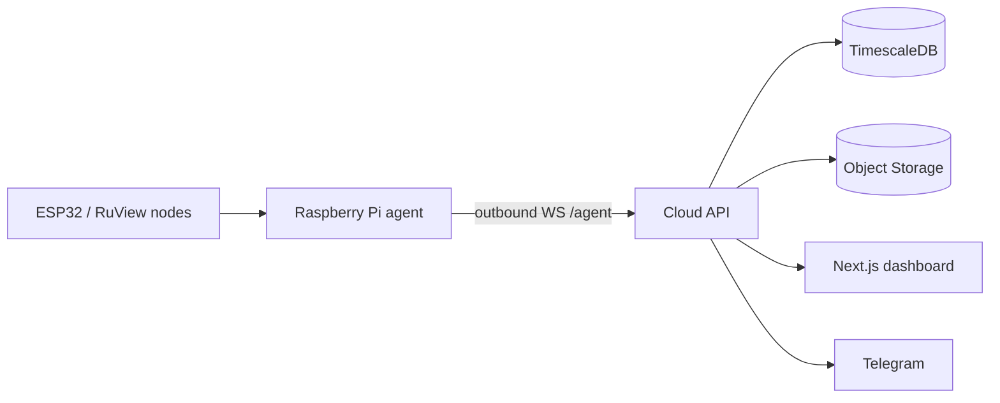

# Architecture

HomeMonitor is built around an outbound-only home relay.

## Cloud relay

The Raspberry Pi connects to `WS /agent`, sends a `hello` message with a device token, then streams heartbeat, telemetry batches, and events. Every sequenced message receives an `ack`. The Pi agent keeps a local outbox so it can retry after cloud or network downtime.

The web dashboard connects to `WS /live` and receives snapshots plus alert events. REST endpoints provide bootstrap, auth, home state, timeline, device list, invites, and notification settings.

## Data policy

The first version keeps full cloud telemetry:

- scalar telemetry and events in TimescaleDB/Postgres;
- high-frequency CSI payloads as compressed `.jsonl.gz` objects in Yandex Object Storage;
- Object Storage index rows in Postgres;
- raw telemetry retention: 30 days;
- events and aggregates: retained longer for family history and rule tuning.

## UX direction

The default UI is a family dashboard. The first screen answers:

- Is anyone home?
- Which room is active?
- Are there alerts?
- Are the Pi and ESP32 nodes online?

Technical diagnostics, CSI quality, and raw summaries live under Lab/Diagnostics instead of dominating the main screen.
